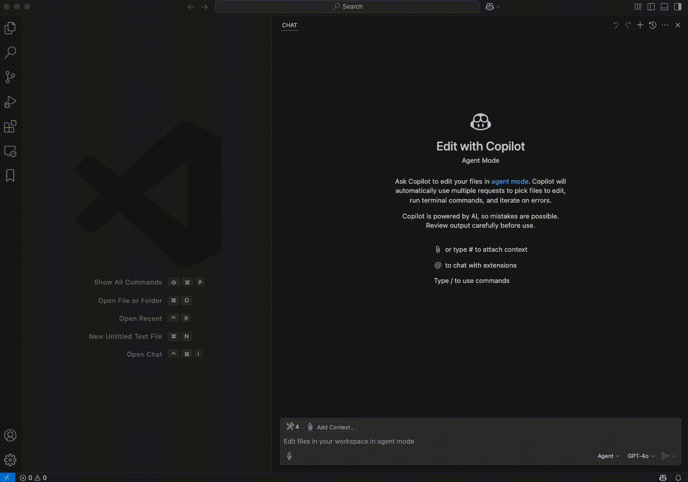
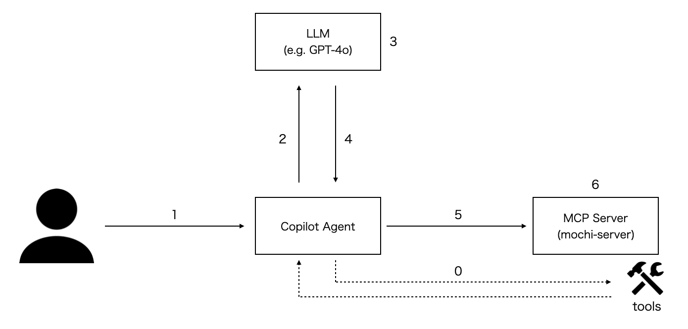
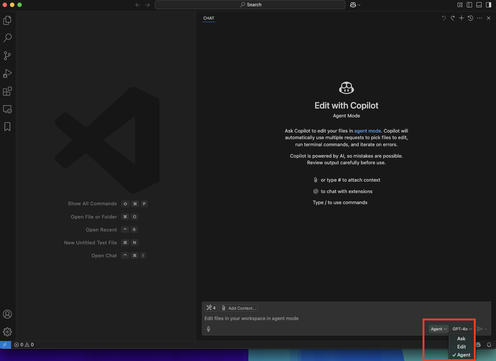

# mochimcp-server
VSCodeの[Copilot Agent Mode](https://code.visualstudio.com/docs/copilot/chat/chat-agent-mode)では[Copilot AgentからMCPサーバーを利用](https://code.visualstudio.com/docs/copilot/chat/mcp-servers)することができる。  
ここでは独自で用意したMCPサーバー(`mochimcp-server`)をCopilot Agentから利用する。



## Overview



- 0. `Copilot Agent`が`MCP Server`からツール情報を取得
- 1. ユーザーが`Copilot Agent`に対してメッセージを送信
- 2. `Copilot Agent`が`LLM`に対してメッセージと`Copilot Agent`が`使用可能なツール情報を送信
- 3. メッセージとツール情報を元に`LLM`が推論を実行
- 4. `LLM`が推論結果として使用すべきツールとツールを実行するための引数を返却(`Tool Calling`)
- 5. `Copilot Agent`が`LLM`からの回答を元にツールを実行するリクエストを`MCP Server`に送信
- 6. `MCP Server`でツールを実行

※この後はツールの実行結果が再度LLMに渡され、その結果を元に生成されたメッセージがユーザーに返されるのが一般的ですが図では省略しています。

なお、今回用意した`mochimcp-server`には以下のツールが含まれている。
- `add`: 2つの値の足し算を行う
- `subtract`: 2つの値の引き算を行う
- `create_file`: ホームディレクトリ配下にファイルを作成する

## Pre-requisites
- `VSCode Version 1.99`
  - [Version 1.99](https://code.visualstudio.com/updates/v1_99)から`Copilot Agent Mode`が利用可能になった
- `uv`コマンドがインストールされていること
  - Installation(https://docs.astral.sh/uv/#getting-started)

### 参考
- [Use agent mode in VS Code](https://code.visualstudio.com/docs/copilot/chat/chat-agent-mode)
- [Use MCP servers in VS Code](https://code.visualstudio.com/docs/copilot/chat/mcp-servers)

## パッケージ同期
```bash
uv sync
```

## VSCodeの設定
`VSCode`の設定(`setting.json`)にて、以下のようにMCPサーバー(`mochimcp-server`)を追加する。

`setting.json`
```json
    "mcp": {
        "inputs": [],
        "servers": {
            "mochimcp-server": {
                "command": "uv",
                "args": [
                    "--directory",
                    "/PATH/TO/DIR/mochimcp-server",
                    "run",
                    "mochimcp-server.py"
                ],
            }
        }
    },
```


`Copilot Chat`を`Agent`モードに変更する。
